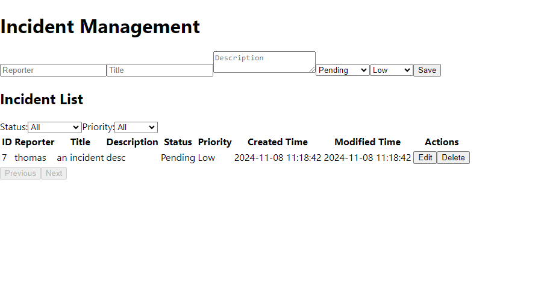

# Incident Management Frontpage

## Overview

This is the frontpage project of the [incident](https://github.com/Thomas-JiangWu/incident) project.

## How to Run this Project

There are 2 ways to run this project:
- Run this project using `npm` command:
```sh
npm install axios
npm start
```
- Run this project using `Docker`:
```sh
docker run -d -p 3000:80 thomasjiangangwu/incident:frontpage-1.0.0
```
The container image `thomasjiangangwu/incident:frontpage-1.0.0` is built based on the Dockerfile of this project and can be pulled publicly.

After running this project, you can open the address in your browser to see the page:
```sh
http://localhost:3000/
```


Also, please make sure you already run the [incident](https://github.com/Thomas-JiangWu/incident) project to make this frontpage work correctly.